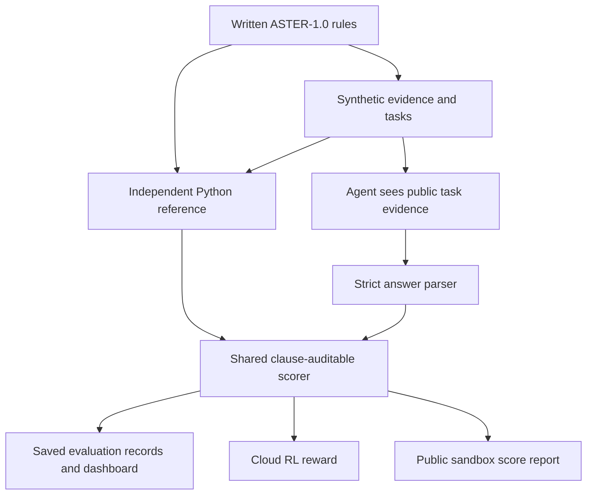

# Understand Aster Payroll Gym

Start here before the interview or Loom. Read the simple explanation first, work
through the example, then practise the professional explanation aloud. You do not
need to memorise every line of code. You do need to understand what makes an answer
correct, what makes a score trustworthy, and which results actually exist.

If a term is unfamiliar, use [the plain-English glossary](glossary.md).

**Current status:** implementation and lightweight engineering QA are green. Real
model evaluation, Colab training, human reviews, the public sandbox and Loom remain
pending. This guide describes implemented workflows without claiming they have all
been executed. The evidence is in [final-qa.json](final-qa.json).

## 1. Explain it very simply

Imagine a school for an AI assistant. The assistant needs to learn how to read
some documents, calculate an employee's pay, and ask for help when a document is
missing or contradictory.

The school needs five things:

1. **A rulebook.** Everyone follows the same rules.
2. **Practice questions.** Some are easy, some require several calculations, and
   some cannot safely be answered yet.
3. **An answer checker.** A normal Python program works out the correct answer.
4. **A fair score.** The AI earns credit for correct work and loses credit for
   guessing or pretending to know missing information.
5. **A report card.** We save the answers, scores and mistakes so someone else can
   check our conclusions.

That school is **Aster Payroll Gym**. "Aster" is a made-up place, and "AST" is a
made-up currency. We invented the rules so every question has a precise answer or
a precise reason why an answer cannot be calculated. There is no real customer
data or real country's tax law here.

The three difficulty levels are:

- **Tier 1: find something.** "What is the allowance in the schedule that applies
  on this payment date?"
- **Tier 2: work something out.** "Read the salary and attendance documents, then
  calculate gross pay, contribution, taxable pay, tax and net pay."
- **Tier 3: notice a problem.** "The previous earnings figure is missing," "two
  equally authoritative salary records disagree," or "no schedule covers this
  date." The useful answer is a specific request for the evidence needed next.

An assistant does not get a good score just for saying "I cannot answer." It must
identify the actual problem. If the question can be solved, refusing it is wrong.

The assignment asked for the whole school: the questions, checker, scoring system,
model comparisons, training experiment, dashboard and a public place where someone
else can submit an answer. It also asked for evidence and documentation so a
reviewer can trust the school.

**What has been built:** the rules, questions, checker, scorer, tools, evaluation
runner, dashboard, sandbox code, cloud training workflow, tests and documentation.
The repository and dashboard are online. Local sandbox checks passed.

**What you still need to do:** independently review the questions and rule
implementation, run the model experiments in Colab or through remote APIs, publish
the sandbox, review the actual failures, and record the Loom. No model was trained
on your laptop. The dashboard currently shows real deterministic baseline tests;
the model and training sections correctly say pending.

## 2. Explain it professionally

### A spoken introduction

> Aster Payroll Gym is a synthetic, verifiable environment for training and
> evaluating AI agents on monthly payroll tasks. It uses a separate versioned
> rulebook and an independent Python reference calculator. Tasks cover retrieval,
> interacting arithmetic rules and evidence gaps that require clarification. One
> clause-auditable scorer is shared across evaluation, reinforcement learning and
> an external submission API. The design emphasises reward integrity, reproducible
> evidence and held-out evaluation. The implementation and lightweight QA are
> complete; actual model and training findings must come from the cloud runs.

That last sentence is the correct status today. Replace it with measured results
only after the corresponding records exist. Do not announce a model improvement
or a transfer finding before an experiment has produced it.

### What the company is asking you to demonstrate

The take-home tests whether you can turn a narrowly defined professional workflow
into an environment an AI agent can practise and be evaluated in. The difficult
part is making the reward faithful to the written authority, preventing shortcuts,
and proving any apparent improvement on tasks the model did not train on.

The implementation covers the eight phases:

1. A strict task/answer contract and twelve seed tasks.
2. Deterministic synthetic generation and independent Python ground truth.
3. Single-turn and tool-use environments with bounded execution.
4. An auditable reward with hard gates, partial credit and a constrained judge.
5. A resumable evaluation CLI with rollouts, statistics, transcripts and budgets.
6. A deployable saved-results dashboard.
7. A Colab-only small-model RL loop with checkpoints and held-out comparison.
8. An independent task/submission/run sandbox with persistence and limits.

There is exactly one advanced track: **Track B, transfer testing**. Five separately
assembled tasks change the presentation while retaining the same rules. Your
authorship or edits and approval, freeze, and measured results are still needed.

The [traceability register](traceability.md) maps 117 PDF and engineering
requirements to implementation, checks and evidence. An "implemented" row means
the software or document exists; it does not certify an unrun experiment.

### Why this domain was chosen

Payroll naturally requires document authority, effective dates, chained arithmetic
and deciding when evidence is sufficient. A fictional jurisdiction makes each
decision testable against a fixed rulebook while keeping data synthetic. The scope
is one monthly payroll slice, not a production payroll service.

The main limitation is external validity: success on this gym would establish
performance under ASTER-1.0, not readiness to handle actual payroll law. Tier 1
also has a small answer vocabulary: two fields across two schedules. Different
dates and distractors do not create new rule knowledge. This limitation is recorded
in [task-schema.md](task-schema.md).

## 3. Follow one answer through the project



The diagram shows implemented paths. Model execution and training are pending.

1. **Rules define truth.** [The rulebook](../rules/aster-payroll-v1.md) contains
   clauses R1–R11. If Python disagrees with the prose, the implementation is wrong.
2. **Generation creates inputs.** [generator.py](../src/aster_gym/generator.py)
   creates salary documents, attendance, schedule evidence and missing/conflicting
   cases. It does not ask an LLM to decide the answer.
3. **The reference calculates private labels.**
   [reference.py](../src/aster_gym/reference.py), especially `solve`, applies the
   rules to inputs. It imports neither the generator nor a model library.
4. **The agent answers.** In single-turn mode it receives the permitted evidence.
   In tool mode it obtains required reference evidence through `read_document`
   or `lookup_rules`; `calculate` performs bounded arithmetic. The evaluation
   harness requires at least one successful reference read, not both tool names.
5. **The parser checks the contract.**
   [parser.py](../src/aster_gym/parser.py) rejects malformed JSON, wrappers,
   duplicate keys and invalid value types. There are exactly six answer keys.
6. **The scorer checks substance.**
   [scoring.py](../src/aster_gym/scoring.py) compares answers and clauses, applies
   hard gates, and invokes the judge only when eligible.
7. **The evidence is saved.** Evaluations retain configuration, full transcripts,
   score components, tokens, latency, retries and costs. Reports are rendered
   from those records rather than invented values.

The generator and reference are separate code responsibilities, but that alone
does not prove fidelity to the rulebook. Hand-derived tests help; your independent
human audit remains essential.

## 4. A payroll example you can explain yourself

This is a teaching example checked with the Python calculator. It is not a model
output or experimental result. All numbers are **integer cents**.

For payment on 2030-04-30, suppose the latest applicable signed salary is 300,000
cents per month. The employee was paid for all 30 of 30 calendar days, has a 20,000
cent bonus, and has already earned 1,190,000 pensionable cents during 2030.

1. **R2 selects the salary.** Use the latest signed record effective by the pay
   date. A newer unsigned document cannot replace it.
2. **R3 calculates gross pay.** `300,000 × 30 / 30 + 20,000 = 320,000` cents.
3. **R4 applies the contribution ceiling.** The annual ceiling is 1,200,000
   cents, leaving `1,200,000 − 1,190,000 = 10,000`. Contribution is
   `min(320,000, 10,000) × 5% = 500` cents. Charging 5% on all gross pay would be
   wrong because most of it is above the remaining ceiling.
4. **R5 finds taxable pay.** `320,000 − 500 − 10,000 allowance = 309,500` cents.
5. **R6 uses marginal tax.** The first 100,000 costs zero tax. The next 200,000
   costs 20,000. The last 9,500 costs 1,900. Total tax is 21,900 cents.
6. **R7 finds net pay.** `320,000 − 500 − 21,900 = 297,600` cents, or
   **2,976.00 AST**.

A valid answer is:

```json
{
  "decision": "answer",
  "result": {
    "gross_cents": 320000,
    "contribution_cents": 500,
    "taxable_cents": 309500,
    "tax_cents": 21900,
    "net_cents": 297600
  },
  "issue_codes": [],
  "missing_fields": [],
  "citations": ["R1", "R2", "R3", "R4", "R5", "R6", "R7", "R8", "R10"],
  "explanation": ""
}
```

This earns 1.0 under the deterministic ordinary rubric. The order of distinct
citation IDs does not matter.

Now remove `ytd_pensionable_cents`. You cannot know the remaining contribution
ceiling. R4 explicitly requires this evidence, even if you suspect the value is
zero. The correct structured response is:

```json
{
  "decision": "needs_information",
  "result": null,
  "issue_codes": ["MISSING_INPUT"],
  "missing_fields": ["ytd_pensionable_cents"],
  "citations": ["R4", "R9", "R10"],
  "explanation": "Provide the 2030 pensionable earnings before this payroll so the remaining contribution ceiling can be calculated."
}
```

The blocker and clauses are checked by Python. Its final explanation score still
requires the configured remote judge; without that judge this otherwise eligible
answer is pending, not automatically 1.0. If two equally authoritative salaries
conflict, the agent instead identifies `SALARY_CONFLICT`. If the pay date is in
2031, no written schedule covers it and the agent identifies `NO_SCHEDULE`.

## 5. The reward design: the most important interview topic

For determined work, weights are **60% exact correctness, 25% field accuracy,
10% appropriate action/content and 5% format**. For unresolved work, they are
**55% exact blocker diagnosis, 25% issue/field accuracy, 10% appropriate
action/content, 5% explanation judge and 5% format**.

The usual determined tasks are Tier 1/2 and the usual unresolved tasks are Tier 3.
The scorer chooses the rubric from the reference's evidence-supported decision,
not from the difficulty label. A label must never tell an agent whether to refuse.

Weights alone are insufficient: an incorrect answer could accumulate points for
pretty formatting. The hard gates prevent that:

- Invalid output: **zero**.
- Computing an answer when the evidence is indeterminate: **zero**.
- Asking for information on a solvable task: **zero**.
- Rejected substantive content or missing required clauses: at most
  `min(0.20, 0.25 × field_accuracy)`; no format/action bonus is added.
- A correct blocker with a missing or unusable explanation: **0.20**.
- An eligible correct blocker with an unavailable judge: **pending, score null**.

Format by itself earns no positive total reward. A complete ordinary answer earns
1.0. A correct trap with an adequate explanation earns 0.975; with an excellent
explanation it earns 1.0. Pass-rate reporting uses **score ≥ 0.975**. A low partial
score supplies learning feedback; it is not approval of the answer.

The judge has only one job: judge whether an otherwise correct blocking explanation
communicates the problem and useful next action. It cannot calculate payroll,
change ground truth, or overturn Python's rejection. Its prompt is versioned,
its eligible results are cached consistently, and reliability requires your
labels plus repeated uncached judgments. A 5% weight does not make it harmless:
a judge label of zero activates the explanation gate, so false negatives matter.

Three deliberately weak programmatic policies test shortcuts: output only a valid
shape, reuse a constant payslip, or always refuse. Saved runs show the first two
score 0 on the current full evaluation corpus. Always-refuse averages about
0.0146 through limited blocker partial credit and is nowhere near a passing score.
Their repeated SD is zero because the outputs are deterministic. This is evidence
about those attacks, not evidence of model ability or proof that every hack is gone.

Read [reward-spec.md](reward-spec.md) and
[saved-results.md](saved-results.md) before recording the reward section.

## 6. Evaluation, training and transfer are different

**Evaluation** asks a fixed model to answer tasks and records its performance. It
does not update weights. The plan compares three configurations on the same frozen
30-task cohort with three stochastic rollouts, runs the small model on all 120
evaluation tasks, and compares tool use on twelve tasks. Means, sample SD and
coverage are reported together. The sample SD is across three complete replicate
means, rather than all pooled task scores. A provider outage is an operational failure,
not a wrong payroll answer.

**Training** updates a small model using the shared reward. The cloud workflow
uses Qwen2.5-0.5B-Instruct with LoRA and GRPO. For each prompt, four completions
are sampled. Completions that score better than their group's average receive
positive relative advantages. A clipped policy objective and KL penalty limit
how the policy moves. Equal-reward groups provide no reward preference; their
frequency is logged rather than hidden.

The initial reference is frozen. With fresh LoRA adapters disabled, the frozen
backbone represents the initial policy. Code checks initial enabled/disabled
logit equivalence on a probe, verifies freezing and compares full parameter
digests before/after. Those checks need actual execution to become evidence.

Two runs use beta 0.001 and 0.10, each starting from the initial model. Beta controls
the strength of the KL penalty. Validation chooses the winner; the evaluation set
must not be used to tune beta. The untouched evaluation set then measures initial
versus selected performance with three rollouts each. The required curves are
reward, KL, entropy, completion length and per-tier pass rate. Other audit logs
include components, KL penalty and identical-reward groups.

**Transfer testing** keeps the rules but changes presentation in five tasks that
require your human review and freezing. It asks whether model rankings and mistakes change when prompts look less
like the generated templates. Five tasks support a modest diagnostic finding,
not a broad statistical claim about real-world payroll.

The frozen data contains **12 seeds, 30 train, 15 validation, 120 evaluation and
5 transfer tasks**. Seeds and normalized input fingerprints are separated. The
fingerprint deliberately ignores irrelevant payroll distractors for retrieval:
changing a bonus must not disguise the same schedule request as a new task.

All small-model inference and training run in recognized Colab with CUDA and an
explicit start. Guards run before ML imports or weight downloads. There is no
local CPU/MPS fallback. Checkpoints stay in cloud storage; only checked JSON result
bundles come back to your Mac. Read [colab.md](colab.md) for the exact workflow.

## 7. The public sandbox and the dashboard

The **sandbox** is the independent exam desk. `/tasks` issues at most ten tasks
in a run. `/submit` accepts answers. `/runs/{run_id}` retrieves the run and scoring
state. `/healthz` checks the service. Private task provenance, reference answers,
submission state and scores are persisted. Run-token authentication, quotas,
payload bounds and idempotent submissions protect the contract.

Public response models expose only permitted fields. They omit server-owned
ground truth, raw private inputs, seeds and trap tags. The public rulebook and
source evidence are allowed to contain the information needed to solve a task.
An answer submitted by a caller may also appear in that caller's transcript.
That is distinct from leaking an oracle answer.

Offline repository datasets deliberately contain reference labels for auditing
and training. The live API issues its own tasks and does not serialize those
private labels. Fresh private provenance and public-field boundaries are central
to the sandbox design.

The **dashboard** is the report viewer. It renders saved evidence without running
models: leaderboard and error bars, tier/components, failure heatmap, transcripts,
cost/latency, learning curves and transfer findings. Hosting the static dashboard
does not host the API. GitHub Pages is live; the Render/Neon sandbox still needs
deployment and independent testing.

## 8. What you can honestly say today

- The code was implemented with substantial Codex assistance, including specialized
  AI subagents. Python computed every stored ground-truth label; no LLM did.
- There are 178 passing lightweight tests, green lint/type checks, an eight-check
  clean clone and green GitHub CI. Tests establish software properties, not learning.
- A separate public-contract Decimal client completed a local Tier-2 fetch,
  correct submission and run retrieval with score 1.0. This was a programmatic
  smoke test, not a model run or deployed public service test.
- Genuine adversarial-baseline artifacts exist. Actual model evaluation, judge
  agreement, RL improvement, transfer findings and reward-gaming searches still
  require the corresponding experiments and your review.

Do not say "I wrote every line unaided," "training improved the model," "the judge
is reliable," or "the public sandbox is deployed" while those claims are untrue.
After completing the remaining work, describe exactly what you ran, reviewed,
changed and measured. [ai-usage.md](ai-usage.md) is the disclosure to keep current.

## 9. A manageable reading order

1. **First 15 minutes:** read sections 1–4 here and redo the arithmetic yourself.
2. **Next 15 minutes:** read the rulebook, reward specification and `score` function.
   Explain why formatting, guessing and blanket refusal cannot pass.
3. **Next 15 minutes:** read architecture and Colab documents. Explain the difference
   between practice, validation and the final exam, and why the Mac is protected.
4. **Next 15 minutes:** use [interview-preparation.md](interview-preparation.md).
   Answer aloud before reading each suggested answer.
5. Follow [submission-walkthrough.md](submission-walkthrough.md) to produce missing
   evidence. Then rehearse [loom-script.md](loom-script.md) using actual records.

Keep [interview-cheatsheet.md](interview-cheatsheet.md) open during rehearsal. It is
your one-page reminder; the full guides explain the reasoning behind each line.
